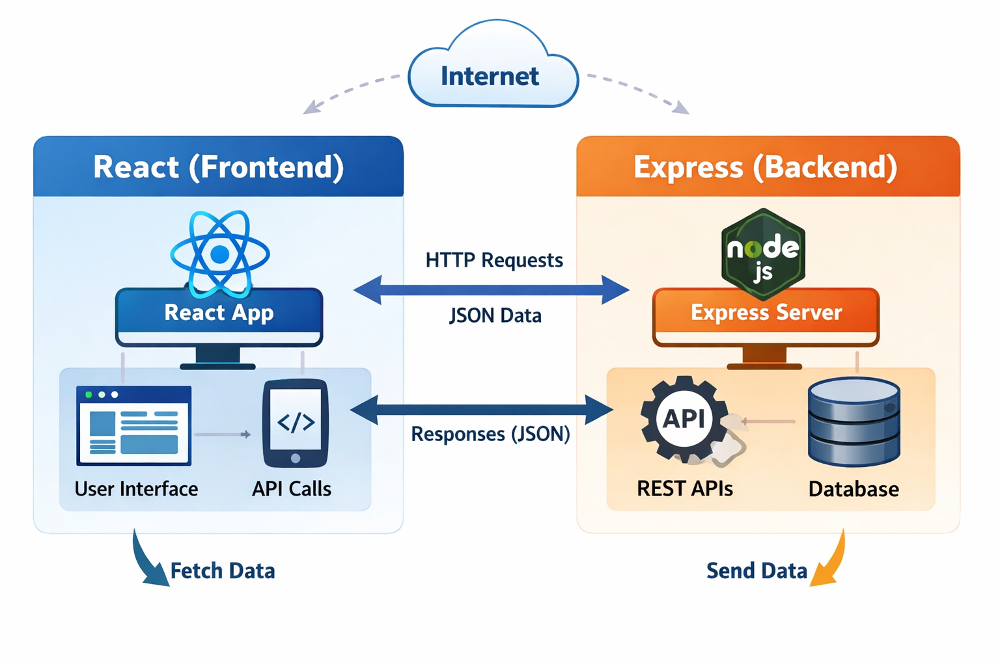

React is a fantastic choice to dive into! 🚀 It’s one of the most popular JavaScript libraries for building user interfaces, especially single-page applications where you want smooth, dynamic updates without reloading the whole page.

### 🌟 Why React is powerful
- **Component-based**: You build small, reusable pieces (like buttons, forms, cards) and combine them into larger apps.
- **Virtual DOM**: React updates only what’s necessary, making apps fast and efficient.
- **Ecosystem**: Huge community, tons of libraries, and strong support from Facebook and open-source contributors.
- **Flexibility**: Works well with other tools like Redux, Next.js, or even plain APIs.

### ⚡ Quick "Hello World" in React
Here’s a minimal example to get you started:

```javascript
import React from "react";
import ReactDOM from "react-dom";

function App() {
  return <h1>Welcome to React, Firman!</h1>;
}

ReactDOM.render(<App />, document.getElementById("root"));
```

### 🛠 How to run it
1. Install Node.js (if you haven’t already).
2. Create a new React app:
   ```bash
   npx create-react-app my-app
   cd my-app
   npm start
   ```
3. Open `src/App.js` and replace the content with the snippet above.
4. Your browser will show **Welcome to React, Firman!**

---
Here’s the workflow diagram you asked for — it’s ready now!  



This visual shows how **React (Frontend)** and **Express (Backend)** communicate:  
- React handles the **UI** and makes **API calls**.  
- Express receives those **HTTP requests**, processes them through **REST APIs**, and interacts with the **database**.  
- The backend then sends back **JSON responses**, which React uses to update the interface instantly.  

This flow is the backbone of most modern full-stack apps.  

---
Perfect, Firman! Let’s build a **mini hands-on project** where React fetches data from an Express API — a great way to see the full workflow in action.  

---

### 🧩 Project Overview
We’ll create:
- **Backend (Express)** → serves a simple JSON API.  
- **Frontend (React)** → fetches and displays that data.  

---

### ⚙️ Step 1: Set up Express backend
Create a folder called `backend` and inside it run:
```bash
npm init -y
npm install express cors
```

Then create `server.js`:
```javascript
const express = require("express");
const cors = require("cors");
const app = express();
app.use(cors());

const users = [
  { id: 1, name: "Alice", role: "Developer" },
  { id: 2, name: "Bob", role: "Tester" },
  { id: 3, name: "Charlie", role: "Manager" },
];

app.get("/api/users", (req, res) => {
  res.json(users);
});

app.listen(5000, () => console.log("Server running on port 5000"));
```

Run it:
```bash
node server.js
```

---

### ⚛️ Step 2: Set up React frontend
In a separate folder:
```bash
npx create-react-app frontend
cd frontend
npm start
```

Edit `src/App.js`:
```javascript
import React, { useEffect, useState } from "react";

function App() {
  const [users, setUsers] = useState([]);

  useEffect(() => {
    fetch("http://localhost:5000/api/users")
      .then((res) => res.json())
      .then((data) => setUsers(data));
  }, []);

  return (
    <div>
      <h1>Team Members</h1>
      <ul>
        {users.map((user) => (
          <li key={user.id}>
            {user.name} — {user.role}
          </li>
        ))}
      </ul>
    </div>
  );
}

export default App;
```

---

### 🔄 Step 3: Run both servers
- Backend → `node server.js`
- Frontend → `npm start`

React will fetch data from Express and display the list of users dynamically.

---
